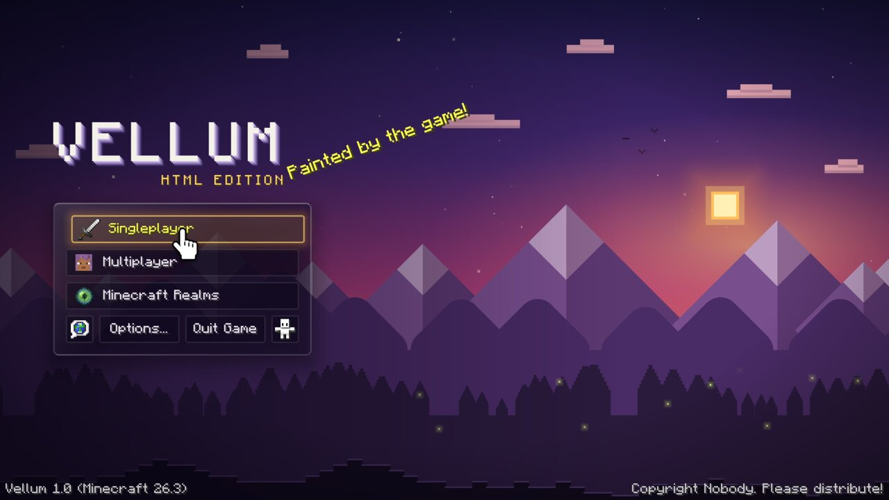
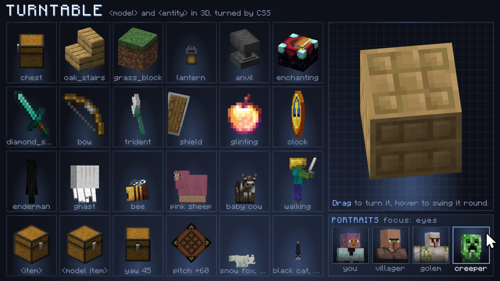
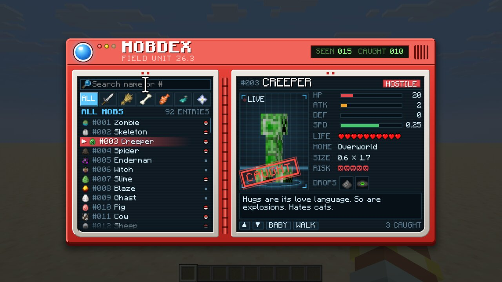
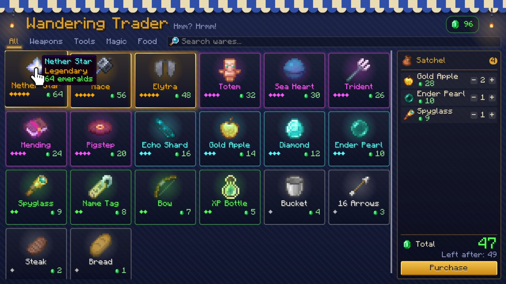

# Vellum

[CurseForge](https://www.curseforge.com/minecraft/mc-mods/vellum-gui) | [Modrinth](https://modrinth.com/mod/vellum-gui) | [Docs](docs/API.md)

Vellum is a small web engine inside Minecraft. Screens, inventories, HUD and map can be expressed as an HTML page, and Vellum lays it out, animates it, runs its scripts and draws it with the normal GUI renderer. It runs on Minecraft 26.3 and 1.21.1, on NeoForge and Fabric.

You may not need to install this yourself. It's a library for other mods.

The inspiration for Vellum was two-fold:

- I'm a web developer and my Minecraft GUIs have always looked bad
- LLMs are better at web development than Minecraft GUI development

Vellum helps in both these cases.

<table>
  <tr>
    <td width="50%"></td>
    <td width="50%"></td>
  </tr>
  <tr>
    <td width="50%"></td>
    <td width="50%"></td>
  </tr>
</table>

### What you get

- Most of CSS: block, inline, flexbox, grid and positioning, transitions and `@keyframes`. Its goal is to be a 90-10 solution compared to a complete browser.
- The game's own look by default. Buttons, text fields, panels, slots and tooltips use vanilla sprites and the game font, so an unstyled page already fits in.
- Put `<slot index="0">` wherever you want a slot and vanilla mechanics will Just Work(tm): clicking, dragging, shift-clicking and tooltips.
- Minecraft-specific elements: `<item>`, `<slot>`, 3D `<entity>` and `<model>`, sprites, translations and player heads.
- JavaScript with Vue-style templates (`v-for`, `v-if`, `v-model`, `@click`).
- HUD overlays, narration/accessibility support, and a standalone previewer with hot reload, so you (or your agent) can build a page without launching the game.
- Pure Java with the JS engine relocated, so it won't clash with anything in a big modpack.
- Speed. A few hundred elements restyle and relayout in well under a millisecond.

Where Vellum behaves differently from a browser, the docs say so.

```html
<div class="mc-panel chest">
  <h2 class="mc-label">{{ title }}</h2>
  <div class="grid">
    <slot v-for="i in 27" :index="i - 1"></slot>
  </div>
  <button @click="vellum.send('sort')">Sort</button>
</div>
<style>
  .chest { width: 176px; margin: auto; }
  .grid { display: grid; grid-template-columns: repeat(9, 18px); }
  button { transition: transform .15s ease-out; }
  button:hover { transform: scale(1.05); }
</style>
```

### For mod developers

Vellum is in development. Other mods (Chronicle, claudemons) use it as a library. [`docs/API.md`](docs/API.md) covers the Java side, [`docs/SCRIPTING.md`](docs/SCRIPTING.md) the JavaScript dialect and templates, and [`docs/MIGRATING.md`](docs/MIGRATING.md) porting an existing screen.

### Servers

A server mod can open a page on a player's client, push data to it and get messages back. Since a server might be hostile, scripts run in a Rhino sandbox with no Java access, no network access, no file access, and sensible resource caps. Players can always close a page with Shift+Esc, and `config/vellum.properties` lets them block server pages entirely.

## Try it

Start a dev client (see Building) and run these in a world:

| Command | What |
|---|---|
| `/vellum showcase` | A gallery of six full pages: a title screen, a HUD kit, a trader's market, a mobdex, a journal and a chat console for a robot. `/vellum showcase <name>` opens one directly. |
| `/vellum demo` | The feature demos: settings, layout, animation, templates, a map and a HUD overlay. `/vellum demo <name>` opens one. |
| `/vellum demo chest` | A chest-style inventory made of `<slot>`s (operators only) |
| `/vellum demo live` | A page the server pushes live data to (operators only) |
| `/vellum open <url>` | Any page, by resource id, for example `vellum:vellum/demo/map.html` |
| `/vellum reload` | Reload pages without restarting the client |

In a dev environment pages are read from `src/main/resources`, so saving one reloads it in the open screen.

## Previewer

You can also build pages without launching Minecraft. The previewer renders a page in a Swing window with the engine and the game's real font and sprites (read from your Minecraft jar), reloads when you save, and has an F12 inspector that outlines the hovered element's box model.

```bash
./gradlew :preview:run --args="path/to/page.html --scale 3 --size 427x240"
./gradlew :preview:run --args="page.html --snapshot out.png --frames 30"   # headless PNG
```

Flags, keys and how it finds the jar are in [`preview/README.md`](preview/README.md).

## Modules

| Module | What |
|---|---|
| `engine/` | No Minecraft dependencies. Contains the DOM, HTML and CSS parsers, cascade, layout, animation, painting to an abstract canvas, input and forms, sandboxed scripting |
| `rhino/` | Mozilla Rhino 1.9.1 with Vellum's patches, relocated to `dev.vellum.shadow.rhino` |
| `common/` | Vanilla-only Minecraft code: the canvas over Minecraft's GUI drawing, screens, container screens, HUD overlays, networking, the public API, demos |
| `neoforge/`, `fabric/` | Loader entrypoints |
| `<loader>/versions/<minecraft>/` | Where Stonecutter builds each Minecraft version, and the code of one version only (see Versions) |
| `preview/` | The standalone previewer |

## Building

You need JDK 25 or newer and git; Gradle provisions the toolchains (25 for 26.3, 21 for 1.21.1).

Vellum uses a patched Rhino. The build downloads the upstream source pinned in `gradle.properties` (once, checked
against its SHA-256), applies the patches in `rhino/patches` and compiles it, so there is nothing to install first.
[`rhino/README.md`](rhino/README.md) says what the patches do and how to change them.

```bash
./gradlew :engine:test                 # engine tests
./gradlew build                        # everything, both Minecraft versions, including Fabric's headless GameTests
./gradlew :neoforge:26.3:runClient     # dev client (or :fabric:26.3, :neoforge:1.21.1, :fabric:1.21.1)
./gradlew :neoforge:26.3:runGameTestServer   # NeoForge's GameTests
./gradlew :preview:installDist         # previewer, at preview/build/install/preview/bin/preview
```

## Versions

Vellum builds for two Minecraft versions from one source tree, with [Stonecutter](https://stonecutter.kikugie.dev):

| Minecraft | NeoForge | Fabric | Java |
|---|---|---|---|
| 26.3 | 26.3.0.26-beta | Loader 0.19.5, Fabric API 0.161.0+26.3 | 25 |
| 1.21.1 | 21.1.255 | Loader 0.19.5, Fabric API 0.116.17+1.21.1 | 21 |

Each version has its own Gradle projects, named after it: `:common:1.21.1`, `:neoforge:1.21.1`, `:fabric:1.21.1`.
Their settings are in `stonecutter.properties.toml`. The engine, Rhino and the previewer are built once and shared.
The jars are `vellum-<loader>-<minecraft>-<version>.jar` (`vellum-neoforge-1.21.1-0.3.0.jar`) in
`<loader>/versions/<minecraft>/build/libs/`, and `./gradlew publishToMavenLocal` publishes
`dev.vellum:vellum-{common,neoforge,fabric}-<minecraft>` for both versions at the same Vellum version.

The sources are written for 26.3. Where 1.21.1 differs, Stonecutter comments (`//? if >=26 {`) pick the code, and
renames such as `Identifier`/`ResourceLocation` are replacements in `stonecutter.gradle`. Code that differs a lot
lives in one file per version under `common/versions/<minecraft>/src`: `McGui` (drawing), `McClient` (screens and
input), `KeyNames`, `Scene` and `EntityPortrait` (3D), `GameTests`. Keep committed sources on 26.3: if you switch
Stonecutter's active version to work on 1.21.1, switch back before committing.

Everything works on 1.21.1, with these differences:

- `<entity>` and `<model>` can't fade: under half opacity they aren't drawn, as items aren't on either version. `-mc-tint` works.
- `VellumEntities.registerPortraitState` doesn't exist, since 1.21.1 has no entity render states. Entity `components`
  are ignored, and `variant` and `color` are set through the entity's NBT.
- The CSS `cursor` shows over screens only, not over HUD overlays.
- Fabric draws HUD overlays after the whole HUD, since 1.21.1 has no HUD layers.
- Key events are GLFW's: `DocumentDriver.onKey` handlers get `dev.vellum.mod.client.input.KeyEvent` with GLFW key codes.
- The dev tour (`-Ptour`) is 26.3 only.

## Releases

[`CHANGELOG.md`](CHANGELOG.md) has what changed in each version. To release one:

1. Set `version` in `gradle.properties` and add a `## <version>` section to `CHANGELOG.md`.
2. Commit, then tag and push: `git tag v0.4.0 && git push origin v0.4.0`.

The tag runs `.github/workflows/release.yml`, which builds, uploads the four jars to Modrinth and CurseForge (the
project ids are `modrinth_id` and `curseforge_id` in `gradle.properties`, the tokens the `MODRINTH_TOKEN` and
`CURSEFORGE_TOKEN` secrets) and makes a GitHub release. Versions are betas until `release_type` says otherwise.
Running the workflow by hand is a dry run, and so is `./gradlew publishMods -PpublishDryRun` locally: both show what
would be uploaded and upload nothing.

## License

LLMs were used in the development of Vellum.

Vellum is MIT (`LICENSE`). The jars bundle Mozilla Rhino, which is MPL-2.0: it is built from the upstream commit
pinned in `gradle.properties` (Rhino 1.9.1) with the patches in [`rhino/patches`](rhino/patches), and its license,
notices and a note on where that source is ship in each jar under `META-INF/licenses/rhino/`.
