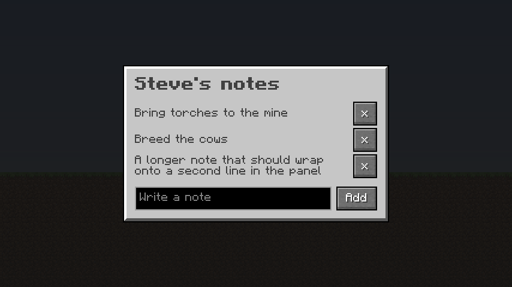

# Vellum mod template

Two small mods to start from, one for NeoForge and one for Fabric, on Minecraft 26.3. Each adds a `/notes` command that
opens a notes page: the mod gives the page your notes, and the page sends back what you add and remove.



## Start a mod

Copy the folder for your loader:

```bash
npx degit MaxLeiter/vellum/template/neoforge my-mod
```

(or `template/fabric`). Then in `my-mod`:

1. Set `mod_id`, `mod_name`, `mod_group_id` and the rest in `gradle.properties`.
2. Rename the `com.example.examplemod` package and the `assets/examplemod` folder to match. On NeoForge, `MOD_ID` in
   `ExampleModClient` has to match too.
3. `./gradlew runClient`, open a world and type `/notes`.

On macOS, if the client hangs on its first frame, add `enableVsync:false` to `runs/client/options.txt`.

## What's in it

- `src/main/resources/assets/examplemod/vellum/notes.html` is the page: HTML, CSS and a Vue-style template, with a
  few lines of script.
- `Notes.java` opens the page with its data and handles the messages it sends.
- `ExampleModClient.java` registers `/notes`.
- `build.gradle` gets Vellum from [maven.maxleiter.com](https://maven.maxleiter.com).
- `neoforge.mods.toml` or `fabric.mod.json` makes Vellum a required dependency. Don't bundle Vellum in your jar.
  Players install it like any other mod, and launchers do it for them when you list it as a required dependency on
  your Modrinth and CurseForge pages.

While `runClient` is running, saving `notes.html` reloads the open page, so you can change it without restarting
the game. The [previewer](../preview/README.md) shows a page without launching Minecraft at all.

## Next

- [Opening pages](../docs/api/pages.md): data, messages, opening pages from the server.
- [Containers](../docs/api/containers.md): inventories with real slots.
- [Scripting](../docs/SCRIPTING.md): the JavaScript and templates.
- [All docs](../docs/index.md)
